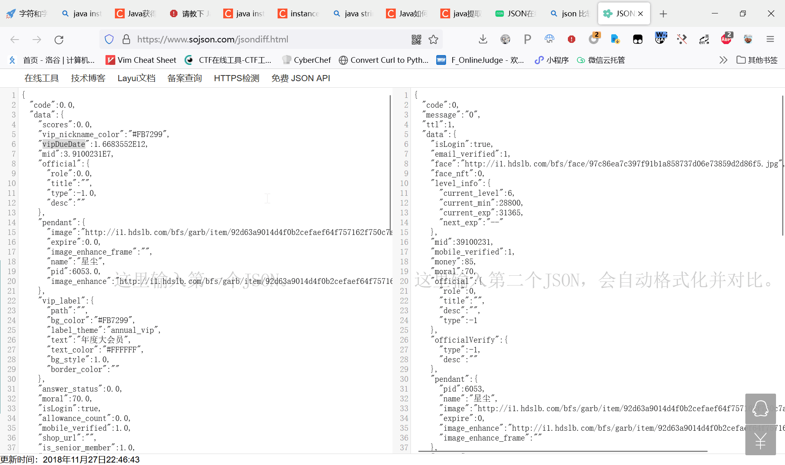

  
主要实现思路是递归。我们把单个值也当作合法的json，先判断当前json类型，如果是单个值就直接return对应类型（解析时）或toString（编码时），如果是Object就遍历它的key值，然后取冒号后面的部分递归解析/编码，Array也差不多。  
经解码再编码测试非常完美。  
  

知识点：java泛型类如HashMap<String, Object>无法用instanceof检测。  
但是，可以新写一个空类去继承他，这样就不是泛型了。  

（Java快加个rust那种枚举吧）  

Warning有点多，将就看  
```java
package fun.zhufn.oldcomm;

import java.util.ArrayList;
import java.util.HashMap;
import java.util.List;
import java.util.Map;

class BadJsonException extends RuntimeException {
}

class JsonMap extends HashMap<String, Object> {

}

class JsonList extends ArrayList<Object> {

}

public class MyJsonParser {
    static void print(String s) {
        System.out.println(s);
    }
    public static Object parse(String json) throws BadJsonException {
        json = json.trim();
        if (json.startsWith("[") && json.endsWith("]")) {
            JsonList ret = new JsonList();
            json = json.substring(1, json.length() - 1);
            while(true) {
                int p1 = 0, p2 = findNextComma(json), len = json.length();
                String curLine = json.substring(p1, p2).trim();
                ret.add(parse(curLine));

                if (p2 < len) json = json.substring(p2 + 1);
                else break;
            }
            return ret;
        } else if (json.startsWith("{") && json.endsWith("}")) {
            return nextObject(json);
        } else if (json.startsWith("\"") && json.endsWith("\"")) {
            int cnt = 0;
            for (int i = 0; i < json.length(); ++i) {
                if (json.charAt(i) == '"' && (i > 0 && json.charAt(i - 1) != '\\')) {
                    ++cnt;
                }
            }
            if (cnt > 2) throw new BadJsonException();
            return json.substring(1, json.length() - 1);
        } else if (json.equals("true")) {
            return true;
        } else if (json.equals("false")) {
            return false;
        } else {
            try {
                return Double.parseDouble(json);
            } catch (Exception e) {
                throw new BadJsonException();
            }
        }
    }

    private static JsonMap nextObject(String json) throws BadJsonException {
        JsonMap ret = new JsonMap();
        if (!json.startsWith("{") || !json.endsWith("}")) {
            throw new BadJsonException();
        }
        json = json.substring(1, json.length() - 1);
        if (json.isEmpty()) return ret;
        while(true) {
            int p1 = 0, p2 = findNextComma(json), len = json.length();
            String curLine = json.substring(p1, p2).trim();
            if (curLine.startsWith("\"")) {
                int j = stringPos(curLine);
                String key = curLine.substring(1, j);
                curLine = curLine.substring(j + 1).trim();
                if (!curLine.startsWith(":")) throw new BadJsonException();
                ret.put(key, parse(curLine.substring(1).trim()));
            } else {
                throw new BadJsonException();
            }
            if (p2 < len) json = json.substring(p2 + 1);
            else break;
        }
        return ret;
    }

    private static int intPos(String str) throws BadJsonException {
        int i = -1;
        while (i + 1 < str.length() &&str.charAt(i + 1) >= '0' && str.charAt(i + 1) <= '9') {
            ++i;
        }
        if (i == -1) {
            throw new BadJsonException();
        }
        return i;
    }

    private static int stringPos(String str) throws BadJsonException {
        if (!str.startsWith("\"")) {
            throw new BadJsonException();
        }
        int i = 1;
        while (i < str.length()) {
            if (str.charAt(i) == '"') {
                break;
            }
            ++i;
        }
        if (i == str.length()) throw new BadJsonException();
        return i;
    }

    private static int findNextComma(String json) throws BadJsonException {
        int quoteCnt = 0, squareBracketsCnt = 0, bracesCnt = 0;
        int len = json.length();
        int i = 0;
        while (i < len) {
            if (json.charAt(i) == ',' && quoteCnt % 2 == 0 && squareBracketsCnt == 0 && bracesCnt == 0) {
                break;
            }
            if (json.charAt(i) == '"') {
                ++quoteCnt;
            }
            if (json.charAt(i) == '[') {
                ++squareBracketsCnt;
            }
            if (json.charAt(i) == '{') {
                ++bracesCnt;
            }
            if (json.charAt(i) == ']') {
                --squareBracketsCnt;
            }
            if (json.charAt(i) == '}') {
                --bracesCnt;
            }
            ++i;
        }
        return i;
    }

    public static String gen(Object data) {
        if (data instanceof JsonMap) {
            StringBuilder ret = new StringBuilder("{");
            JsonMap mp = (JsonMap)data;
            for (String key: mp.keySet()) {
                ret.append("\"").append(key).append("\":");
                ret.append(gen(mp.get(key)));
                ret.append(",");
            }
            ret.delete(ret.length() - 1, ret.length());
            ret.append("}");
            return ret.toString();
        } else if (data instanceof JsonList) {
            StringBuilder ret = new StringBuilder("[");
            for (Object v: (JsonList)data) {
                ret.append(gen(v));
                ret.append(",");
            }
            ret.delete(ret.length() - 1, ret.length());
            ret.append("]");
            return ret.toString();
        } else if (data instanceof String) {
            return "\"" + data + "\"";
        } else {
            return data.toString();
        }
    }

    public static void main(String []args) {
        //这是一组测试数据，应该没人来开我盒
        print(gen(parse("""
                {"code":0,"message":"0","ttl":1,"data":{"isLogin":true,"email_verified":1,"face":"http://i1.hdslb.com/bfs/face/97c86ea7c397f91b1a858737d06e73859d2d86f5.jpg","face_nft":0,"level_info":{"current_level":6,"current_min":28800,"current_exp":31365,"next_exp":"--"},"mid":39100231,"mobile_verified":1,"money":85,"moral":70,"official":{"role":0,"title":"","desc":"","type":-1},"officialVerify":{"type":-1,"desc":""},"pendant":{"pid":6053,"name":"星尘","image":"http://i1.hdslb.com/bfs/garb/item/92d63a9014d4f0b2cefaef64f757162f750c7ad0.png","expire":0,"image_enhance":"http://i1.hdslb.com/bfs/garb/item/92d63a9014d4f0b2cefaef64f757162f750c7ad0.png","image_enhance_frame":""},"scores":0,"uname":"BuringStraw","vipDueDate":1668355200000,"vipStatus":1,"vipType":2,"vip_pay_type":0,"vip_theme_type":0,"vip_label":{"path":"","text":"年度大会员","label_theme":"annual_vip","text_color":"#FFFFFF","bg_style":1,"bg_color":"#FB7299","border_color":""},"vip_avatar_subscript":1,"vip_nickname_color":"#FB7299","vip":{"type":2,"status":1,"due_date":1668355200000,"vip_pay_type":0,"theme_type":0,"label":{"path":"","text":"年度大会员","label_theme":"annual_vip","text_color":"#FFFFFF","bg_style":1,"bg_color":"#FB7299","border_color":""},"avatar_subscript":1,"nickname_color":"#FB7299","role":3,"avatar_subscript_url":"http://i0.hdslb.com/bfs/vip/icon_Certification_big_member_22_3x.png"},"wallet":{"mid":39100231,"bcoin_balance":1,"coupon_balance":0,"coupon_due_time":0},"has_shop":false,"shop_url":"","allowance_count":0,"answer_status":0,"is_senior_member":1}}""")));
    }
}

```
